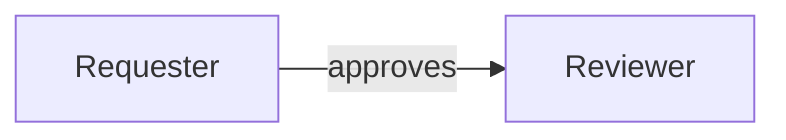

# Mermaid Diagram Viewer

A small native Windows desktop viewer for Mermaid (`.mmd`) files. It renders
locally and displays the diagram—not the Mermaid source text. Nothing is
uploaded, and no browser window or web server is used.

The bundled application logo is stored at `assets/app-logo.png`.

## Requirements

- Python 3.10+ with Tkinter (included in the standard Windows Python installer)
- Node.js 18+
- Mermaid CLI, installed locally with:

```powershell
npm install
```

You can also double-click `setup.bat`. This keeps the renderer inside this
project rather than changing the global npm installation.

## Run

```powershell
py mermaid_viewer.py
```

Click **Open diagram** and select a Mermaid file. Flowcharts open as interactive
native graphs: drag an entity to reposition it and its connected relationships.
Each relationship label and line share a color, also shown in the legend.
Unsupported Mermaid diagram types continue to use the static local renderer.

Click an entity, relationship, or legend item to see its meaning. Meanings are
optional Mermaid comments placed before the flowchart:



Standard lineage labels such as `READS`, `WRITES`, `MUTATES`, `VALIDATES`,
`CALLS`, and `EXPOSES` have built-in meanings. Explicit `%% relation`
comments override the built-in description when a diagram needs more context.

Use the toolbar to zoom, fit the diagram to the window, or reload it after
editing it elsewhere. Drag the empty canvas to pan a large diagram, use the
mouse wheel to zoom, Shift+wheel to scroll horizontally, and double-click to fit.

Keyboard shortcuts:

- `Ctrl+O`: open a file
- `Ctrl+R`: reload the current file
- `Ctrl++` / `Ctrl+-`: zoom

Try the included `sample.mmd` to confirm the setup.
