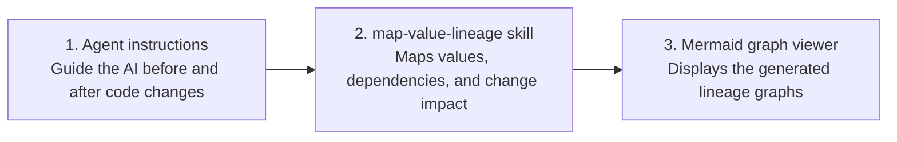

# Value Lineage and Change-Impact Mapping

This project helps Codex and Claude Code understand how an entity value moves through an application, where it can change, and what may be affected by a code change.

This project consists of three components:



1. *Agent instructions* — Help the AI understand the application and assess impact before making changes.

2. *map-value-lineage skill* — Generates versioned JSON and Mermaid files that map value lineage, dependencies, changes, and related commits.

3. **Mermaid graph viewer** — Opens and displays the generated Mermaid graphs from the **`entities_graphics`** directory.


## 1. Project agent instructions

The `AGENTS.md` file contains the instructions Codex follows before and after changing an application.

Place `AGENTS.md` in the root directory of the project or Codex project sandbox:

```text
<project-directory>\AGENTS.md
```

The instructions require Codex to:

- Read the latest entity graph before changing code.
- Understand the relevant values, methods, APIs, storage, events, and downstream effects.
- Perform impact analysis before implementation.
- Commit the application change first.
- Generate a new numbered graph version containing the application commit hash.
- Store the new graph under `entities_graphics`.

## 2. Agent skill for Codex and Claude Code

The `map-value-lineage` skill contains the reusable mapping workflow and JSON structure. Copy the * complete skill directory * to `.codex\skills` for Codex or `.claude\skills` for Claude Code.

The skill follows the Agent Skills `SKILL.md` format and can be used with both Codex and Claude Code.

### Install for Codex

Copy the complete skill directory into the current user's Codex skills directory.

| Operating system | Codex skill path |
| --- | --- |
| Windows | `C:\Users\<username>\.codex\skills\map-value-lineage\SKILL.md` |
| macOS | `~/.codex/skills/map-value-lineage/SKILL.md` |
| Linux or WSL | `~/.codex/skills/map-value-lineage/SKILL.md` |

The `SKILL.md` file must exist directly inside the `map-value-lineage` directory. For example, on Windows:

```text
C:\Users\<username>\.codex\skills\map-value-lineage\SKILL.md
```

Restart Codex or open a new task after installing the skill.

Invoke it in Codex with:

```text
Use $map-value-lineage to map <Entity>.<value> and analyze the impact of the requested change.
```

### Install for Claude Code

Copy the complete skill directory into the current user's Claude Code skills directory.

| Operating system | Claude Code skill path |
| --- | --- |
| Windows | `C:\Users\<username>\.claude\skills\map-value-lineage\SKILL.md` |
| macOS | `~/.claude/skills/map-value-lineage/SKILL.md` |
| Linux or WSL | `~/.claude/skills/map-value-lineage/SKILL.md` |

The `SKILL.md` file must exist directly inside the `map-value-lineage` directory. For example, on Windows:

```text
C:\Users\<username>\.claude\skills\map-value-lineage\SKILL.md
```

The skill may also be installed for one project under:

```text
<project-directory>\.claude\skills\map-value-lineage\SKILL.md
```

Invoke it in Claude Code with:

```text
/map-value-lineage
```

Claude Code can also select the skill automatically when the request matches its description.

The skill produces:
The user must create an **`entities_graphics`** directory in the project’s root directory. The generated JSON and Mermaid graph files will be stored there.

```text
<entity>-<value>-vNNN.json
<entity>-<value>-vNNN.mmd
```

Save both files in the project's graph directory:

```text
<project-directory>\entities_graphics\<entity>\
```

Do not overwrite an older graph. Increment the version number for every new application change.

## 3. Mermaid graph viewer
Mermaid graph viewer — Helps users understand how values flow through the application and how changes made by the agent affect the data flow.

The Mermaid graph viewer displays the generated `.mmd` graph files.

Important: Read the README file in the Mermaid graph viewer directory before installing or running the viewer.

### Install

Run:

```text
setup.bat
```

### Start the viewer

After installation, run:

```text
run_viewer.bat
```

### Open a graph

1. Start `run_viewer.bat`.
2. Select or upload the required `.mmd` file.
3. Find generated graph files under:

```text
<project-directory>\entities_graphics\
```

If the project is running in a Codex sandbox, use the `entities_graphics` directory inside that sandbox instead.

## Expected workflow

```text
Install the agent skill for Codex or Claude Code
-> place AGENTS.md in the project root
-> inspect the latest graph
-> analyze the requested change
-> update and test the application
-> commit the application change
-> generate the next JSON and Mermaid graph version
-> add the application commit hash to the JSON
-> save the files under entities_graphics
-> commit the new graph version
-> view the .mmd file with the Mermaid graph viewer
```

## Directory example

```text
project-root\
|-- AGENTS.md
|-- entities_graphics\
|   `-- order\
|       |-- order-status-v001.json
|       |-- order-status-v001.mmd
|       |-- order-status-v002.json
|       `-- order-status-v002.mmd
`-- application-files...

C:\Users\<username>\.codex\skills\
`-- map-value-lineage\
    |-- SKILL.md
    |-- agents\
    |-- assets\
    |-- references\
    `-- scripts\

C:\Users\<username>\.claude\skills\
`-- map-value-lineage\
    |-- SKILL.md
    |-- agents\
    |-- assets\
    |-- references\
    `-- scripts\
```
